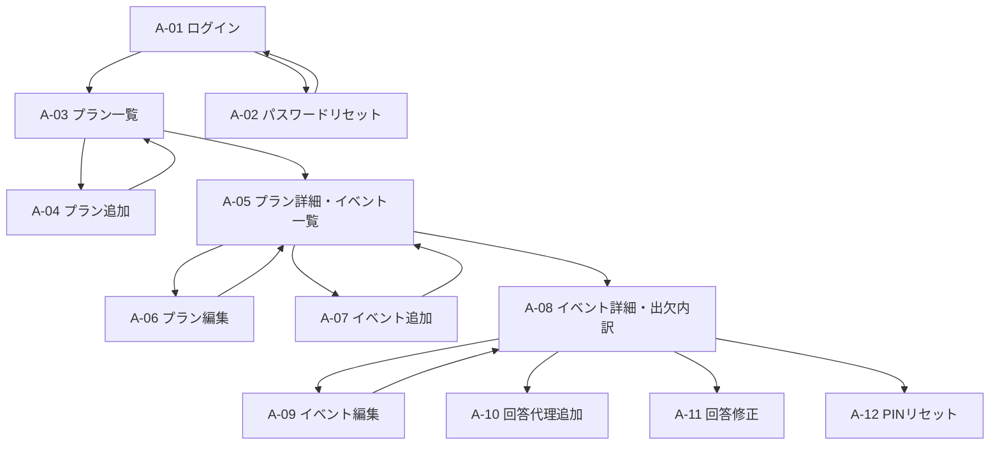
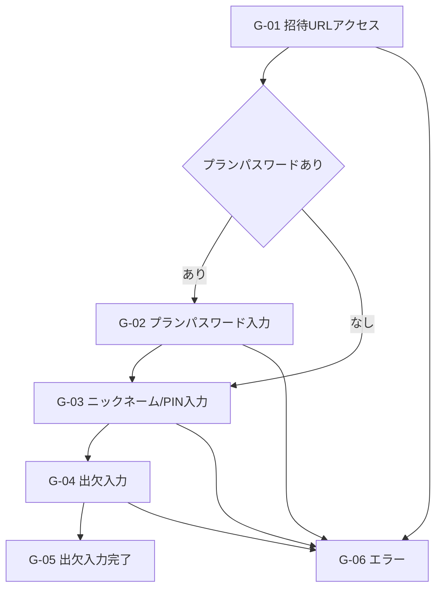

# イベント参加者調整App MVP画面仕様書

作成日: 2026-06-01

## 1. 位置づけ

本書はMVPで実装する画面、画面遷移、表示項目、操作、入力チェック、エラー表示を定義する。

関連文書:

- `docs/mvp-requirements.md`
- `docs/system-design.md`

## 2. 画面設計方針

### 2.1 共通

- 招待者画面はスマホ優先で設計する。
- 管理画面はPCで一覧と詳細を確認しやすい設計にする。
- 削除はすべて無効化として表現する。
- 物理削除を想起させる場合でも、確認ダイアログでは「無効化」と明示する。
- 保存中、保存成功、保存失敗を画面上で判別できるようにする。
- 入力エラーは対象項目の近くに表示する。
- 操作不可の理由は、可能な限りボタン付近または対象行に表示する。

### 2.2 文言方針

- 画面上では、イベント管理者向けの領域を「管理画面」と表記する。
- 要件定義上の役割名は「イベント管理者」を使用する。
- 招待者向けには、システム用語を避け、短い案内文にする。
- PINは「4桁のPIN」と表記する。
- プランパスワードは「プランパスワード」と表記し、ログインパスワードと混同しない。

## 3. 画面一覧

### 3.1 イベント管理者向け

| ID | 画面 | パス | 認証 |
| --- | --- | --- | --- |
| A-01 | ログイン | `/login` | 不要 |
| A-02 | パスワードリセット | `/password-reset` | 不要 |
| A-03 | プラン一覧 | `/admin/plans` | 必須 |
| A-04 | プラン追加 | `/admin/plans/new` | 必須 |
| A-05 | プラン詳細・イベント一覧 | `/admin/plans/{planId}` | 必須 |
| A-06 | プラン編集 | `/admin/plans/{planId}/edit` | 必須 |
| A-07 | イベント追加 | `/admin/plans/{planId}/events/new` | 必須 |
| A-08 | イベント詳細・出欠内訳 | `/admin/plans/{planId}/events/{eventId}` | 必須 |
| A-09 | イベント編集 | `/admin/plans/{planId}/events/{eventId}/edit` | 必須 |
| A-10 | 回答代理追加 | モーダル | 必須 |
| A-11 | 回答修正 | モーダル | 必須 |
| A-12 | PINリセット | モーダル | 必須 |
| A-13 | 通知有効化案内 | モーダルまたはバナー | 必須 |

### 3.2 招待者向け

| ID | 画面 | パス | 認証 |
| --- | --- | --- | --- |
| G-01 | 招待URLアクセス | `/invite/{publicToken}` | 不要 |
| G-02 | プランパスワード入力 | `/invite/{publicToken}` | 不要 |
| G-03 | ニックネーム/PIN入力 | `/invite/{publicToken}/entry` | 不要 |
| G-04 | 出欠入力 | `/invite/{publicToken}/responses` | 招待者セッション |
| G-05 | 出欠入力完了 | `/invite/{publicToken}/complete` | 保存完了状態 |
| G-06 | 招待者向けエラー | `/invite/{publicToken}` または共通エラー表示 | 不要 |

## 4. 画面遷移

### 4.1 イベント管理者



### 4.2 招待者



## 5. 共通コンポーネント

### 5.1 管理画面ヘッダー

表示項目:

- アプリ名
- ログイン中メールアドレス
- ログアウトボタン
- 通知状態表示

操作:

- ログアウト
- 通知有効化導線

### 5.2 管理画面パンくず

表示例:

```text
プラン一覧 > 2026年06月プラン > 6/10 AM
```

### 5.3 確認ダイアログ

対象操作:

- プラン無効化
- イベント無効化
- 回答修正
- PINリセット

必須表示:

- 操作対象名
- 操作後の影響
- 実行ボタン
- キャンセルボタン

### 5.4 トースト/通知メッセージ

表示する状態:

- 保存成功
- 保存失敗
- URLコピー成功
- URLコピー失敗
- 通知許可成功
- 通知許可失敗

## 6. A-01 ログイン

### 6.1 目的

イベント管理者が管理画面にログインする。

### 6.2 表示項目

- メールアドレス入力
- パスワード入力
- ログインボタン
- パスワードを忘れた場合のリンク

### 6.3 入力チェック

| 項目 | チェック |
| --- | --- |
| メールアドレス | 必須、メール形式 |
| パスワード | 必須 |

### 6.4 操作

| 操作 | 結果 |
| --- | --- |
| ログイン | 成功時はプラン一覧へ遷移 |
| パスワードを忘れた場合 | パスワードリセット画面へ遷移 |

### 6.5 エラー

| 条件 | 表示 |
| --- | --- |
| 認証失敗 | メールアドレスまたはパスワードが正しくありません。 |
| 無効アカウント | このアカウントは利用できません。 |
| 通信失敗 | 通信に失敗しました。時間をおいて再度お試しください。 |

## 7. A-02 パスワードリセット

### 7.1 目的

イベント管理者が自分でログインパスワードリセットメールを送信する。

### 7.2 表示項目

- メールアドレス入力
- リセットメール送信ボタン
- ログイン画面へ戻るリンク

### 7.3 操作

| 操作 | 結果 |
| --- | --- |
| リセットメール送信 | Firebase Authenticationのパスワードリセットメールを送信 |
| ログイン画面へ戻る | ログイン画面へ遷移 |

### 7.4 完了表示

```text
パスワードリセット用のメールを送信しました。
メールに記載された手順に従ってパスワードを再設定してください。
```

## 8. A-03 プラン一覧

### 8.1 目的

イベント管理者が自分のプランを一覧し、新規プラン作成や既存プラン管理へ進む。

### 8.2 表示項目

- ページタイトル: `プラン一覧`
- 有効プラン数: `有効プラン x / 3`
- プラン追加ボタン
- 通知有効化状態
- プラン一覧

プラン一覧の表示項目:

| 項目 | 内容 |
| --- | --- |
| プラン名 | プラン名 |
| 年月 | `YYYY年MM月` |
| 状態 | 有効 / 無効 |
| イベント数 | 有効イベント数 |
| 配信用URL | コピー操作 |
| 作成日時 | 表示 |
| 操作 | 詳細、編集、無効化 |

### 8.3 操作

| 操作 | 結果 |
| --- | --- |
| プラン追加 | プラン追加画面へ遷移 |
| 詳細 | プラン詳細・イベント一覧へ遷移 |
| 編集 | プラン編集画面へ遷移 |
| URLコピー | クリップボードへコピー |
| 無効化 | 確認後、プランを無効化 |
| 通知を有効にする | 通知許可UIを開始 |

### 8.4 状態別表示

| 状態 | 表示 |
| --- | --- |
| 有効プラン3件 | プラン追加ボタンを無効化し、`有効プランは最大3件までです。` を表示 |
| プラン0件 | 空状態メッセージとプラン追加ボタンを表示 |
| 無効プラン | 無効ラベルを表示し、招待者URLが利用不可であることを示す |

## 9. A-04 プラン追加

### 9.1 目的

イベント管理者が新しいプランを作成する。

### 9.2 入力項目

| 項目 | 必須 | UI | チェック |
| --- | --- | --- | --- |
| プラン名 | 必須 | テキスト入力 | 空不可 |
| 年月 | 必須 | 年月選択 | 空不可 |
| プランパスワード | 任意 | パスワード入力 | 空の場合は未設定 |

### 9.3 操作

| 操作 | 結果 |
| --- | --- |
| 保存 | プランを作成し、配信用URLを表示 |
| キャンセル | プラン一覧へ戻る |

### 9.4 作成完了表示

表示項目:

- 作成成功メッセージ
- 配信用URL
- コピーボタン
- イベント追加へ進むボタン
- プラン一覧へ戻るボタン

## 10. A-05 プラン詳細・イベント一覧

### 10.1 目的

プラン情報とイベント一覧を確認し、イベント作成、編集、出欠確認へ進む。

### 10.2 表示項目

- プラン名
- 年月
- 状態
- プランパスワード設定有無
- 配信用URL
- コピーボタン
- イベント追加ボタン
- イベント一覧

イベント一覧の表示項目:

| 項目 | 内容 |
| --- | --- |
| 日程 | `YYYY/MM/DD` |
| 時間帯 | AM / PM |
| イベント名 | 未入力時は `イベント名未設定` |
| 場所 | 場所 |
| ステータス | 受付中 / 締切済 |
| 出欠サマリー | `○ x / △ x / × x` |
| 操作 | 詳細、編集、ステータス変更、無効化 |

### 10.3 並び順

```text
日程昇順 -> 時間帯順(AM, PM) -> 登録順
```

### 10.4 操作

| 操作 | 結果 |
| --- | --- |
| プラン編集 | プラン編集画面へ遷移 |
| URLコピー | 配信用URLをコピー |
| イベント追加 | イベント追加画面へ遷移 |
| イベント詳細 | イベント詳細・出欠内訳へ遷移 |
| 受付中にする | イベントステータスを受付中へ変更 |
| 締切済にする | イベントステータスを締切済へ変更 |
| イベント無効化 | 確認後、イベントを無効化 |

## 11. A-06 プラン編集

### 11.1 目的

プラン名、年月、プランパスワードを変更する。

### 11.2 入力項目

| 項目 | 必須 | 内容 |
| --- | --- | --- |
| プラン名 | 必須 | 現在値を初期表示 |
| 年月 | 必須 | 現在値を初期表示 |
| プランパスワード | 任意 | 新しいパスワードを設定する場合のみ入力 |
| プランパスワード解除 | 任意 | チェック時にパスワードを解除 |

### 11.3 操作

| 操作 | 結果 |
| --- | --- |
| 保存 | プランを更新 |
| キャンセル | プラン詳細へ戻る |

### 11.4 注意表示

プランパスワードを変更または解除する場合、以下を表示する。

```text
プランパスワードの変更は招待者へ自動通知されません。必要に応じてLINE等で連絡してください。
```

## 12. A-07 イベント追加

### 12.1 目的

プランにイベントを追加する。

### 12.2 入力項目

| 項目 | 必須 | UI | チェック |
| --- | --- | --- | --- |
| イベント名 | 任意 | テキスト入力 | 未入力可 |
| 日程 | 必須 | カレンダー | 空不可 |
| 時間帯 | 必須 | AM/PM選択 | 空不可 |
| 場所 | 必須 | テキスト入力 | 空不可 |

### 12.3 操作

| 操作 | 結果 |
| --- | --- |
| 保存 | イベントを作成し、プラン詳細へ戻る |
| キャンセル | プラン詳細へ戻る |

## 13. A-08 イベント詳細・出欠内訳

### 13.1 目的

イベント単位で出欠サマリーと回答内訳を確認し、管理者代理操作を行う。

### 13.2 表示項目

イベント情報:

- プラン名
- 日程
- 時間帯
- イベント名
- 場所
- ステータス

出欠サマリー:

| 表示 | 内容 |
| --- | --- |
| ○ | 参加人数 |
| △ | 未定人数 |
| × | 不参加人数 |

回答一覧:

| 項目 | 内容 |
| --- | --- |
| ニックネーム | 表示用ニックネーム |
| 出欠 | ○ / △ / × |
| コメント | 自由入力コメント |
| 回答日時 | 最終回答日時 |
| 最終更新者 | 管理者(Admin) / 招待者(Guest) |
| 操作 | 修正、PINリセット |

PINは表示しない。

### 13.3 操作

| 操作 | 結果 |
| --- | --- |
| 回答代理追加 | 回答代理追加モーダルを開く |
| 回答修正 | 回答修正モーダルを開く |
| PINリセット | PINリセットモーダルを開く |
| イベント編集 | イベント編集画面へ遷移 |
| ステータス変更 | 受付中 / 締切済を切り替える |

### 13.4 空状態

回答が0件の場合:

```text
まだ回答はありません。
```

## 14. A-09 イベント編集

### 14.1 目的

イベント情報と受付ステータスを変更する。

### 14.2 入力項目

| 項目 | 必須 | 内容 |
| --- | --- | --- |
| イベント名 | 任意 | 現在値を初期表示 |
| 日程 | 必須 | 現在値を初期表示 |
| 時間帯 | 必須 | AM / PM |
| 場所 | 必須 | 現在値を初期表示 |
| ステータス | 必須 | 受付中 / 締切済 |

### 14.3 操作

| 操作 | 結果 |
| --- | --- |
| 保存 | イベントを更新 |
| キャンセル | イベント詳細へ戻る |

## 15. A-10 回答代理追加

### 15.1 目的

イベント管理者が招待者の回答を代理追加する。

### 15.2 入力項目

| 項目 | 必須 | チェック |
| --- | --- | --- |
| ニックネーム | 必須 | 空不可 |
| PIN | 必須 | 4桁数字 |
| 出欠 | 必須 | ○ / △ / × |
| コメント | 任意 | 長すぎる場合はエラー |

### 15.3 操作

| 操作 | 結果 |
| --- | --- |
| 追加 | 回答を作成し、最終更新者を管理者(Admin)にする |
| キャンセル | モーダルを閉じる |

### 15.4 エラー

| 条件 | 表示 |
| --- | --- |
| 同一ニックネーム別PIN | 同じニックネームは既に使用されています。 |
| PIN形式不正 | PINは4桁の数字で入力してください。 |

## 16. A-11 回答修正

### 16.1 目的

イベント管理者が既存回答を修正する。

### 16.2 入力項目

| 項目 | 必須 | 内容 |
| --- | --- | --- |
| 出欠 | 必須 | ○ / △ / × |
| コメント | 任意 | 現在値を初期表示 |

### 16.3 操作

| 操作 | 結果 |
| --- | --- |
| 保存 | 回答を更新し、回答日時と最終更新者を更新 |
| キャンセル | モーダルを閉じる |

確認文言:

```text
この回答を管理者として修正します。回答日時も更新されます。
```

## 17. A-12 PINリセット

### 17.1 目的

招待者がPINを忘れた場合に、イベント管理者が新PINへ変更する。

### 17.2 表示項目

- 対象ニックネーム
- 新PIN入力
- 新PIN確認入力
- 注意文

注意文:

```text
PINリセットでは既存の出欠回答は変更されません。
新しいPINはLINE等で招待者へ連絡してください。
```

### 17.3 入力チェック

| 項目 | チェック |
| --- | --- |
| 新PIN | 4桁数字 |
| 新PIN確認 | 新PINと一致 |

### 17.4 操作

| 操作 | 結果 |
| --- | --- |
| リセット | PINを更新し、監査ログを記録 |
| キャンセル | モーダルを閉じる |

### 17.5 完了表示

```text
PINをリセットしました。新しいPINを招待者へ連絡してください。
```

## 18. A-13 通知有効化案内

### 18.1 目的

イベント管理者が招待者の回答更新通知を受け取れるようにする。

### 18.2 表示タイミング

- イベント管理者の初回ログイン直後に表示する。
- 初回案内で「あとで」を選んだ場合は、管理画面トップまたはプラン一覧から再表示できる。
- すでに通知許可済みの場合は表示しない。

### 18.3 表示文言

```text
招待者の回答更新を通知で受け取れます。
```

ボタン:

```text
通知を有効にする
あとで
```

### 18.4 操作

| 操作 | 結果 |
| --- | --- |
| 通知を有効にする | ブラウザ通知許可ダイアログを表示 |
| あとで | 案内を閉じる |

### 18.5 状態別表示

| 状態 | 表示 |
| --- | --- |
| 許可済み | 通知設定済み |
| 拒否済み | ブラウザまたは端末設定から通知を許可してください。 |
| 非対応 | この環境では通知を利用できません。 |

## 19. G-01 招待URLアクセス

### 19.1 目的

招待者が配信用URLから対象プランへアクセスする。

### 19.2 表示項目

- プラン名
- 年月
- プランパスワードが必要かどうかに応じた次画面

### 19.3 分岐

| 条件 | 遷移 |
| --- | --- |
| publicToken有効、プラン有効、パスワードなし | ニックネーム/PIN入力へ |
| publicToken有効、プラン有効、パスワードあり | プランパスワード入力へ |
| publicToken不正 | エラー表示 |
| プラン無効 | エラー表示 |

## 20. G-02 プランパスワード入力

### 20.1 目的

プランパスワードが設定されたプランで、招待者アクセスを制御する。

### 20.2 表示項目

- プラン名
- プランパスワード入力
- 次へボタン

### 20.3 入力チェック

| 項目 | チェック |
| --- | --- |
| プランパスワード | 必須 |

### 20.4 エラー

| 条件 | 表示 |
| --- | --- |
| 不一致 | プランパスワードが正しくありません。 |
| プラン無効化 | このプランは現在利用できません。 |

## 21. G-03 ニックネーム/PIN入力

### 21.1 目的

招待者をニックネームとPINで識別する。

### 21.2 表示項目

- プラン名
- ニックネーム入力
- 4桁PIN入力
- 次へボタン

### 21.3 入力チェック

| 項目 | チェック |
| --- | --- |
| ニックネーム | 必須、前後空白除去後に空でない |
| PIN | 必須、4桁数字 |

### 21.4 エラー

| 条件 | 表示 |
| --- | --- |
| 同一ニックネーム別PIN | 同じニックネームは既に使用されています。PINを忘れた場合は管理者へ連絡してください。 |
| PIN形式不正 | PINは4桁の数字で入力してください。 |
| プラン無効化 | このプランは現在利用できません。 |

## 22. G-04 出欠入力

### 22.1 目的

招待者がプラン内のイベントごとに出欠を入力、再編集する。

### 22.2 表示項目

- プラン名
- ニックネーム
- イベント一覧
- 保存ボタン

イベントごとの表示項目:

| 項目 | 内容 |
| --- | --- |
| 日程 | `YYYY/MM/DD` |
| 時間帯 | AM / PM |
| イベント名 | 未入力時は省略または `イベント名未設定` |
| 場所 | 場所 |
| ステータス | 受付中 / 締切済 |
| 出欠 | ○ / △ / × |
| コメント | 自由入力 |

### 22.3 イベント状態別UI

| 状態 | UI |
| --- | --- |
| 受付中、未回答 | 出欠選択とコメント入力を有効 |
| 受付中、回答済 | 既存回答を初期表示し、編集可能 |
| 締切済、未回答 | 入力不可。`締切済のため入力できません。` を表示 |
| 締切済、回答済 | 既存回答を表示し、編集不可 |
| 無効化済み | 表示しない |

### 22.4 操作

| 操作 | 結果 |
| --- | --- |
| 保存 | 回答を保存し、完了画面へ遷移 |
| 戻る | ニックネーム/PIN入力へ戻る |

### 22.5 保存時エラー

| 条件 | 表示 |
| --- | --- |
| 保存直前にプラン無効化 | このプランは現在利用できません。 |
| 保存直前にイベント締切 | 一部のイベントが締切済になったため保存できませんでした。内容を確認してください。 |
| 通信失敗 | 保存に失敗しました。時間をおいて再度お試しください。 |

## 23. G-05 出欠入力完了

### 23.1 目的

保存完了を招待者へ明示し、保存内容を確認できるようにする。

### 23.2 表示文言

```text
出欠入力が完了しました。
再編集する場合は、同一URLからアクセスしてください。
締切後に出欠を変更する場合は管理者にご連絡ください。
```

### 23.3 表示項目

- プラン名
- ニックネーム
- 保存した入力内容
- 同一URLから再編集する案内

入力内容表示:

| 項目 | 内容 |
| --- | --- |
| 日程 | `YYYY/MM/DD` |
| 時間帯 | AM / PM |
| イベント名 | イベント名 |
| 場所 | 場所 |
| 出欠 | ○ / △ / × |
| コメント | コメント |

## 24. G-06 招待者向けエラー

### 24.1 目的

招待者が利用できない状態を分かりやすく伝える。

### 24.2 エラー一覧

| 条件 | 表示 |
| --- | --- |
| publicToken不正 | URLが正しくないか、利用できません。 |
| プラン無効 | このプランは現在利用できません。 |
| セッション期限切れ | 再度ニックネームとPINを入力してください。 |
| 通信失敗 | 通信に失敗しました。時間をおいて再度お試しください。 |

## 25. レスポンシブ仕様

### 25.1 招待者画面

スマホ:

- 1カラム
- イベントごとに縦積みカード表示
- 出欠選択は横並びの大きめボタン
- 保存ボタンは画面下部またはフォーム末尾に明確に配置

PC:

- 中央寄せの狭めコンテナ
- スマホと同じ操作順を維持

### 25.2 管理画面

PC:

- 一覧は表形式を基本とする。
- 出欠内訳は横幅を活かして表示する。
- 主要操作ボタンは画面上部と対象行に配置する。

スマホ:

- 表はカード表示または横スクロールで破綻しないようにする。
- 無効化、PINリセットなどの重要操作は誤タップを避けるため確認を必須にする。

## 26. テスト観点

画面テストは、ケース作成前に以下の観点を列挙してから詳細化する。

### 26.1 機能観点

- ログイン、ログアウト、パスワードリセット
- プラン作成、編集、無効化
- プランパスワード設定、変更、解除
- URLコピー
- イベント作成、編集、無効化
- イベントステータス変更
- 招待者初回入力、再編集
- 管理者代理追加、回答修正
- PINリセット
- 通知許可UI

### 26.2 非機能観点

- スマホ幅での入力しやすさ
- PC幅での一覧視認性
- 低速回線での保存中表示
- 通知非対応ブラウザ
- 通知拒否済みブラウザ
- ネットワーク切断時のエラー表示

### 26.3 データ観点

- PIN先頭0
- 同一ニックネーム同一PIN
- 同一ニックネーム別PIN
- 長いニックネーム
- 長いコメント
- イベント名未入力
- 無効化済みプラン
- 締切済イベント

### 26.4 状態遷移観点

- 初回回答から完了画面へ遷移する。
- 再編集時に既存回答が復元される。
- 受付中から締切済に変更後、招待者画面で編集不可になる。
- PINリセット後、旧PINで入れず新PINで入れる。
- 通知案内で「あとで」を選んだ後、管理画面から再度有効化できる。

## 27. MVP外の画面

以下はMVPでは作成しない。

- アプリ管理者Web管理画面
- イベント管理者自己登録画面
- イベント管理者招待URL画面
- 管理チーム管理画面
- 定員設定画面
- tennis-organizing-app連携画面
