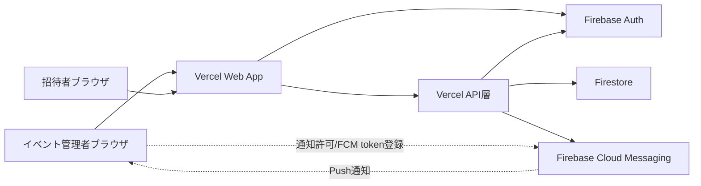
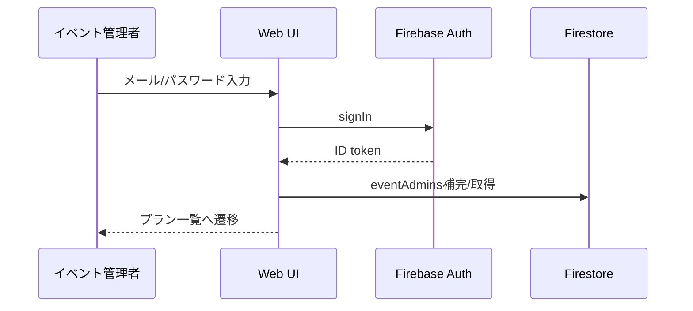
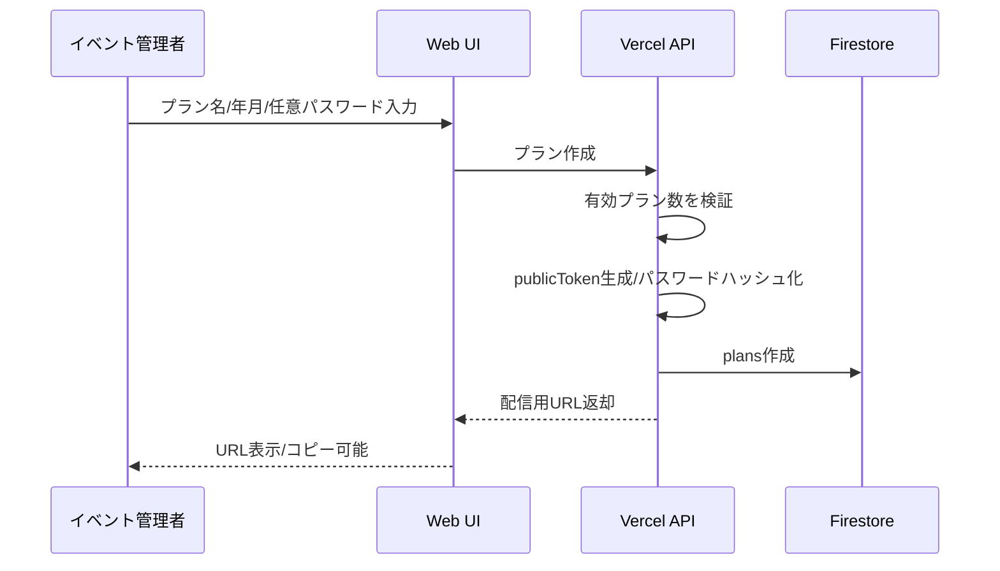
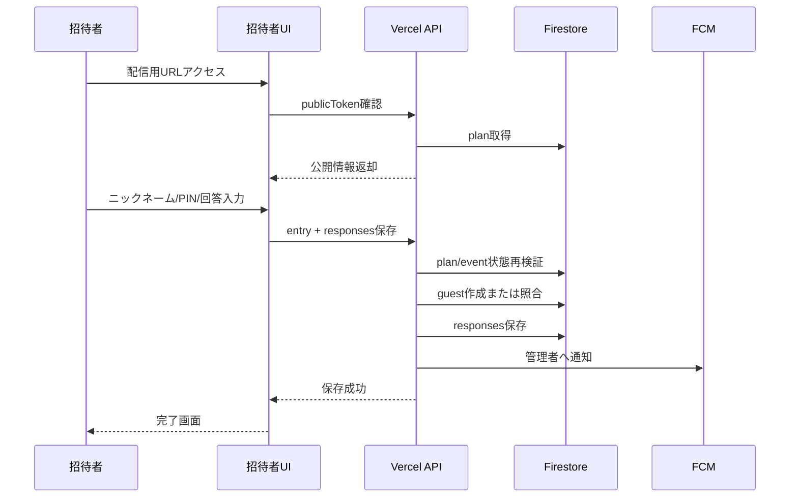
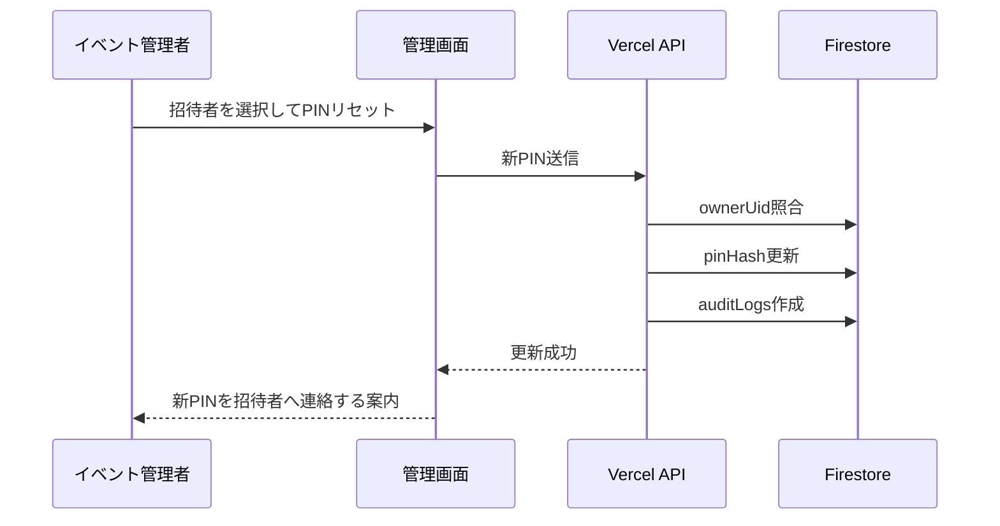

# イベント参加者調整App MVPシステム設計書

作成日: 2026-06-01

## 1. 位置づけ

本書は `docs/mvp-requirements.md` を実装可能な構造へ落とし込むためのMVPシステム設計書である。

MVPでは、以下を最優先で守る。

- イベント管理者ごとのデータ分離
- 招待者に他招待者の回答やPIN関連情報を見せない
- 無効化済みプラン、無効化済みイベント、締切済イベントへの不正更新を防ぐ
- 4桁PINとプランパスワードを平文保存しない
- スマホ招待者UIとPC管理画面の両立
- 業務アプリ寄りの落ち着いたUIで、出欠状況を効率よく確認、集計できること

## 2. 前提

- ホスティングはVercelとする。
- 認証はFirebase Authenticationを使用する。
- データ保存はFirestoreを使用する。
- Push通知はFirebase Cloud Messagingを使用する。
- アプリ管理者向けWeb管理画面はMVP対象外とする。
- イベント管理者アカウントは、アプリ管理者がFirebase Consoleで手動作成する。
- イベント管理者ごとにデータを分離する。
- 招待者はFirebase Authenticationにログインしない。

## 3. 全体構成



### 3.1 役割分担

| 領域 | 責務 |
| --- | --- |
| Web UI | 管理画面、招待者画面、入力状態管理、表示制御 |
| Firebase Auth | イベント管理者のログイン、ログアウト、パスワードリセット |
| Vercel API層 | PIN照合、プランパスワード照合、招待者回答保存、通知送信、監査ログ記録 |
| Firestore | プラン、イベント、招待者、回答、通知token、監査ログの永続化 |
| FCM | イベント管理者への回答更新通知 |

## 4. アプリケーション境界

### 4.1 クライアントから直接扱ってよい処理

- イベント管理者ログイン、ログアウト
- イベント管理者ログインパスワードリセットメール送信
- 管理画面での自分のプラン、イベント、回答の閲覧
- 通知許可状態の表示
- FCM token登録要求

### 4.2 API層を必ず経由する処理

- プランパスワード照合
- 招待者のニックネーム+PIN照合
- 招待者の初回登録
- 招待者回答の保存
- PINリセット
- プランパスワードのハッシュ化保存
- 通知送信
- 監査ログ記録

理由:

- PINは4桁で総当たりされやすいため、`pinHash` を招待者クライアントへ返さない。
- プランパスワードも招待者クライアントへ返さない。
- 招待者保存時は、プラン有効状態、イベント有効状態、締切状態をサーバー側で再検証する。
- 通知送信はサーバー側の認証情報を必要とする。

## 5. 画面ルーティング

| パス | 画面 | 認証 |
| --- | --- | --- |
| `/login` | イベント管理者ログイン | 未ログイン |
| `/password-reset` | ログインパスワードリセット | 未ログイン |
| `/admin/plans` | プラン一覧 | イベント管理者ログイン必須 |
| `/admin/plans/new` | プラン追加 | イベント管理者ログイン必須 |
| `/admin/plans/{planId}` | プラン詳細、イベント一覧 | イベント管理者ログイン必須 |
| `/admin/plans/{planId}/events/new` | イベント追加 | イベント管理者ログイン必須 |
| `/admin/plans/{planId}/events/{eventId}` | イベント詳細、出欠内訳 | イベント管理者ログイン必須 |
| `/invite/{publicToken}` | 招待者アクセス開始 | 不要 |
| `/invite/{publicToken}/entry` | 招待者本人識別 | 不要 |
| `/invite/{publicToken}/responses` | 出欠入力 | 不要。ただし招待者セッション必須 |
| `/invite/{publicToken}/complete` | 出欠入力完了 | 不要。ただし保存完了状態必須 |
| `/error` | 共通エラー | 不要 |

## 6. API設計

### 6.1 管理者向けAPI

| API | Method | 認証 | 内容 |
| --- | --- | --- | --- |
| `/api/admin/plans` | POST | Firebase ID token | プラン作成 |
| `/api/admin/plans/{planId}` | PATCH | Firebase ID token | プラン更新、プランパスワード変更、解除 |
| `/api/admin/plans/{planId}/disable` | POST | Firebase ID token | プラン無効化 |
| `/api/admin/plans/{planId}/events` | POST | Firebase ID token | イベント作成 |
| `/api/admin/events/{eventId}` | PATCH | Firebase ID token | イベント更新、ステータス変更 |
| `/api/admin/events/{eventId}/disable` | POST | Firebase ID token | イベント無効化 |
| `/api/admin/events/{eventId}/responses` | POST | Firebase ID token | 管理者代理回答追加 |
| `/api/admin/responses/{responseId}` | PATCH | Firebase ID token | 管理者回答修正 |
| `/api/admin/guests/{guestId}/pin-reset` | POST | Firebase ID token | PINリセット |
| `/api/admin/notification-tokens` | POST | Firebase ID token | FCM token登録 |

### 6.2 招待者向けAPI

| API | Method | 認証 | 内容 |
| --- | --- | --- | --- |
| `/api/invite/{publicToken}` | GET | 不要 | プラン公開情報取得 |
| `/api/invite/{publicToken}/password` | POST | 不要 | プランパスワード照合 |
| `/api/invite/{publicToken}/entry` | POST | 不要 | ニックネーム+PIN照合、招待者セッション発行 |
| `/api/invite/{publicToken}/responses` | GET | 招待者セッション | 自分の回答取得 |
| `/api/invite/{publicToken}/responses` | POST | 招待者セッション | 自分の回答保存 |

### 6.3 招待者セッション

- 招待者はFirebase Authenticationにログインしない。
- `entry` APIでニックネーム+PIN照合に成功した場合、短期の招待者セッションを発行する。
- セッションには `planId`、`guestId`、`ownerUid`、有効期限を含める。
- セッションはHttpOnly Cookieまたは署名付きトークンで扱う。
- セッション有効期限はMVPでは数時間から1日程度を想定する。
- セッション期限切れ時は、ニックネーム+PIN入力へ戻す。

## 7. データモデル

MVPではトップレベルコレクションを使い、各ドキュメントに `ownerUid` を持たせる。

```text
eventAdmins/{uid}
plans/{planId}
events/{eventId}
guests/{guestId}
responses/{responseId}
notificationTokens/{tokenId}
auditLogs/{auditLogId}
```

### 7.1 eventAdmins

| フィールド | 型 | 必須 | 内容 |
| --- | --- | --- | --- |
| uid | string | yes | Firebase Auth UID |
| email | string | yes | イベント管理者メールアドレス |
| displayName | string | no | 表示名 |
| isActive | boolean | yes | 有効状態 |
| createdAt | timestamp | yes | 作成日時 |
| updatedAt | timestamp | yes | 更新日時 |

MVPでは、アプリ管理者がFirebase ConsoleでAuthユーザーを作成する。アプリ側の `eventAdmins` 作成は初回ログイン時に自動作成するか、管理者初回アクセス時に補完する。

### 7.2 plans

| フィールド | 型 | 必須 | 内容 |
| --- | --- | --- | --- |
| planId | string | yes | プランID |
| ownerUid | string | yes | 作成したイベント管理者UID |
| name | string | yes | プラン名 |
| yearMonth | string | yes | `YYYY-MM` |
| passwordHash | string/null | no | プランパスワードのハッシュ |
| publicToken | string | yes | 配信用URL用の推測困難なtoken |
| isActive | boolean | yes | 有効状態 |
| createdAt | timestamp | yes | 作成日時 |
| updatedAt | timestamp | yes | 更新日時 |

補足:

- 管理画面で配信用URLを継続表示、コピーできるよう、MVPでは `publicToken` を保持する。
- `publicToken` は十分に長いランダム値にし、推測困難にする。
- `publicToken` は招待者アクセスの入口であり、本人識別はニックネーム+PINで別途行う。
- `publicToken` をログに不用意に出力しない。

### 7.3 events

| フィールド | 型 | 必須 | 内容 |
| --- | --- | --- | --- |
| eventId | string | yes | イベントID |
| planId | string | yes | 所属プランID |
| ownerUid | string | yes | プラン所有者UID |
| name | string | no | イベント名 |
| eventDate | string | yes | `YYYY-MM-DD` |
| timeSlot | string | yes | `AM` / `PM` |
| place | string | yes | 場所 |
| status | string | yes | `accepting` / `closed` |
| sortOrder | number | yes | 同一日時内の登録順 |
| isActive | boolean | yes | 有効状態 |
| createdAt | timestamp | yes | 作成日時 |
| updatedAt | timestamp | yes | 更新日時 |

### 7.4 guests

| フィールド | 型 | 必須 | 内容 |
| --- | --- | --- | --- |
| guestId | string | yes | 招待者ID |
| planId | string | yes | 所属プランID |
| ownerUid | string | yes | プラン所有者UID |
| nickname | string | yes | 表示用ニックネーム |
| nicknameKey | string | yes | 重複判定用キー |
| pinHash | string | yes | PINのハッシュ |
| pinResetAt | timestamp/null | no | PINリセット日時 |
| pinResetByUid | string/null | no | PINリセットしたイベント管理者UID |
| createdAt | timestamp | yes | 作成日時 |
| updatedAt | timestamp | yes | 更新日時 |

制約:

- `planId + nicknameKey` は一意に扱う。
- Firestore単体で一意制約が弱い場合は、API層でトランザクションまたは一意キー用ドキュメントを使う。

### 7.5 responses

| フィールド | 型 | 必須 | 内容 |
| --- | --- | --- | --- |
| responseId | string | yes | 回答ID |
| planId | string | yes | プランID |
| eventId | string | yes | イベントID |
| guestId | string | yes | 招待者ID |
| ownerUid | string | yes | プラン所有者UID |
| attendanceStatus | string | yes | `yes` / `maybe` / `no` |
| comment | string | no | コメント |
| answeredAt | timestamp | yes | 回答日時 |
| lastUpdatedBy | string | yes | `admin` / `guest` |
| lastUpdatedByUid | string/null | no | 管理者更新時のUID |
| createdAt | timestamp | yes | 作成日時 |
| updatedAt | timestamp | yes | 更新日時 |

制約:

- `eventId + guestId` は一意に扱う。
- 招待者保存では、対象イベントが有効かつ受付中であることをAPI層で再検証する。

### 7.6 notificationTokens

| フィールド | 型 | 必須 | 内容 |
| --- | --- | --- | --- |
| tokenId | string | yes | token識別子 |
| ownerUid | string | yes | イベント管理者UID |
| fcmToken | string | yes | FCM token |
| userAgent | string | no | 端末識別補助 |
| isActive | boolean | yes | 有効状態 |
| createdAt | timestamp | yes | 作成日時 |
| updatedAt | timestamp | yes | 更新日時 |

### 7.7 auditLogs

| フィールド | 型 | 必須 | 内容 |
| --- | --- | --- | --- |
| auditLogId | string | yes | 監査ログID |
| ownerUid | string | yes | 対象データ所有者UID |
| actorType | string | yes | `admin` / `guest` / `system` |
| actorUid | string/null | no | イベント管理者UID |
| action | string | yes | 操作種別 |
| targetType | string | yes | 対象種別 |
| targetId | string | yes | 対象ID |
| summary | string | no | 操作概要 |
| createdAt | timestamp | yes | 記録日時 |

記録対象:

- PINリセット
- 管理者代理回答追加
- 管理者回答修正
- プラン無効化
- イベント無効化

## 8. インデックス設計

Firestoreで必要になる主な検索条件:

| 対象 | 条件 | 並び順 |
| --- | --- | --- |
| plans | `ownerUid == currentUid`, `isActive` | `createdAt asc` |
| events | `ownerUid == currentUid`, `planId == planId`, `isActive` | `eventDate asc`, `timeSlot asc`, `sortOrder asc` |
| guests | `ownerUid == currentUid`, `planId == planId` | `nicknameKey asc` |
| responses | `ownerUid == currentUid`, `eventId == eventId` | `answeredAt desc` |
| responses | `planId == planId`, `guestId == guestId` | `eventId asc` |
| notificationTokens | `ownerUid == currentUid`, `isActive == true` | なし |
| auditLogs | `ownerUid == currentUid`, `targetId == targetId` | `createdAt desc` |

## 9. セキュリティ設計

### 9.1 イベント管理者データ分離

- すべての管理対象データに `ownerUid` を持たせる。
- イベント管理者は `auth.uid == ownerUid` のデータのみ閲覧、編集できる。
- Firestore Security Rulesでも同条件を必ず検証する。
- API層でもFirebase ID tokenを検証し、`ownerUid` が一致するか確認する。

### 9.2 招待者データ保護

- 招待者向けAPIでは、他招待者の `guests`、`responses` を返さない。
- 招待者向けAPIでは、`pinHash`、`passwordHash` を返さない。
- 招待者は自分の `guestId` に紐づく回答だけ取得できる。
- 招待者セッションの `planId`、`guestId`、`ownerUid` とリクエスト対象を照合する。

### 9.3 PINとパスワード

- PIN、プランパスワードは平文保存しない。
- ハッシュ化はAPI層で行う。
- 4桁PINは低エントロピーのため、`pinHash` をクライアントに返さない。
- PIN照合失敗回数が短時間で多い場合は、レート制限を検討する。

### 9.4 publicToken

- publicTokenは推測困難なランダム値にする。
- 管理画面で配信用URLを表示、コピーするため、MVPでは `plans.publicToken` として保持する。
- `publicToken` は `ownerUid` によるアクセス制御でイベント管理者本人だけが閲覧できるようにする。
- 招待者向けAPIは `publicToken` から対象プランを特定する。
- `publicToken` だけで回答編集を許可せず、プランパスワード、ニックネーム、PIN、招待者セッションで追加確認する。

## 10. 主要処理フロー

### 10.1 イベント管理者ログイン



### 10.2 プラン作成



### 10.3 招待者初回回答



### 10.4 PINリセット



## 11. 状態遷移設計

### 11.1 プラン

| 現状態 | 操作 | 次状態 | 実行者 |
| --- | --- | --- | --- |
| 有効 | 無効化 | 無効 | イベント管理者 |

MVPでは再有効化は必須ではない。

### 11.2 イベント

| 現状態 | 操作 | 次状態 | 実行者 |
| --- | --- | --- | --- |
| 受付中 | 締切 | 締切済 | イベント管理者 |
| 締切済 | 受付再開 | 受付中 | イベント管理者 |
| 有効 | 無効化 | 無効 | イベント管理者 |

### 11.3 回答

| 現状態 | 操作 | 次状態 | 実行者 |
| --- | --- | --- | --- |
| 未回答 | 回答保存 | 回答済 | 招待者 / イベント管理者 |
| 回答済 | 再編集 | 回答済 | 招待者 |
| 回答済 | 管理者修正 | 回答済 | イベント管理者 |

## 12. エラー設計

| エラー | 表示方針 | ログ |
| --- | --- | --- |
| publicToken不正 | 「URLが正しくないか、利用できません。」 | warn |
| プラン無効 | 「このプランは現在利用できません。」 | info |
| プランパスワード不一致 | 入力欄近くにエラー表示 | warn |
| 同一ニックネーム別PIN | 「同じニックネームは既に使用されています。」 | warn |
| 締切済イベント更新 | 対象イベントの保存不可を表示 | info |
| ネットワークエラー | 再試行案内 | error |
| 通知送信失敗 | 管理画面には通常表示しない。ログに残す | warn |

## 13. 通知設計

### 13.1 token登録

- イベント管理者の初回ログイン直後にアプリ内通知有効化案内を出す。
- 「通知を有効にする」押下後にブラウザ通知許可を要求する。
- 許可された場合、FCM tokenを取得し `notificationTokens` に保存する。
- 同一イベント管理者が複数端末で許可した場合、複数tokenを保持する。
- 送信失敗したtokenは `isActive = false` に更新する。

### 13.2 送信条件

- 招待者が回答を追加または更新した場合に送信する。
- イベント管理者による代理追加、修正、PINリセットでは送信しない。
- 通知失敗は回答保存を失敗にしない。

## 14. 非機能設計

### 14.1 レスポンシブ

- 招待者画面はスマホ幅を基準に設計する。
- 招待者画面はニックネーム+PIN入力後、各イベントに対して `○`、`△`、`×` を大きめのボタンで選択できる1カラムUIにする。
- 管理画面はPCで表形式と詳細ペインを扱いやすくする。
- 管理画面のプラン一覧、イベント一覧、出欠内訳はテーブル中心で構成する。
- 管理画面の `○`、`△`、`×` 人数はカードまたはバッジで一目で分かるようにする。
- スマホ管理画面もレイアウトが崩れず、閲覧、操作できるようにする。

### 14.2 ビジュアル方針

- UIはサークル向けのカジュアルアプリではなく、出欠状況を効率よく確認、集計するためのビジネスアプリ寄りにする。
- 全体のデザインは白、グレーをベースにし、アクセントカラーを1色だけ使用する。
- アクセントカラーは主要アクション、選択状態、重要な状態表示に限定する。
- 派手な装飾、SNS風、ゲーム風、ポップすぎる表現は避ける。
- 管理画面では装飾的なカード多用を避け、テーブル、バッジ、必要最小限のサマリーカードを中心に構成する。

### 14.3 競合・非同期

- 招待者保存時にプラン、イベント状態を再取得して検証する。
- 有効プラン3件制限はAPI層のトランザクションで検証する。
- 同一ニックネーム登録はAPI層で一意性を保証する。
- 同時回答保存では `eventId + guestId` の一意性を保証する。

### 14.4 ログ・証跡

- 管理者による重要操作は `auditLogs` に記録する。
- 通知送信失敗は調査できる粒度でログに残す。
- 招待者の通常回答保存は `responses` の `answeredAt` と `lastUpdatedBy` で追跡する。

## 15. 実装時の注意点

- Firestore Security Rulesだけに依存せず、API層でも所有者と状態を検証する。
- 招待者クライアントへハッシュ値や他招待者情報を返さない。
- PINを数値として扱わず、常に4桁文字列として扱う。
- `○`、`△`、`×` はUI表示値と保存値を分離する。
- 物理削除は実装しない。
- 通知許可はユーザー操作後に要求する。

## 16. テスト設計観点

テストケース作成時は、以下の順で観点を列挙してから詳細化する。

### 16.1 機能観点

- イベント管理者認証
- プラン作成、更新、無効化
- 有効プラン3件制限
- イベント作成、更新、無効化
- 招待者初回回答、再編集
- 管理者代理追加、回答修正
- PINリセット
- Push通知

### 16.2 非機能観点

- スマホ招待者UI
- PC管理画面
- 業務アプリ寄りの視認性
- 管理画面テーブルのスマホ崩れ防止
- 低速回線
- 通知拒否
- 複数端末通知
- Firestore権限エラー
- API失敗時の再試行

### 16.3 データ観点

- PIN `0000`、`9999`
- 先頭0を含むPIN
- 同一ニックネーム同一PIN
- 同一ニックネーム別PIN
- 長いニックネーム
- 長いコメント
- イベント名未入力
- 無効化済みデータ

### 16.4 UI観点

- 締切済イベントの非活性表示
- 保存中、保存成功、保存失敗
- URLコピー成功、失敗
- 通知有効化案内
- PINリセット確認

## 17. MVP外として扱う設計

- 管理チーム単位のデータ共有
- イベント管理者招待URL
- イベント管理者自己登録
- プラン有効期限
- 定員管理
- URL再発行
- tennis-organizing-app連携
