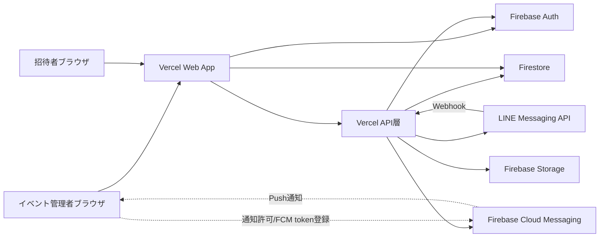
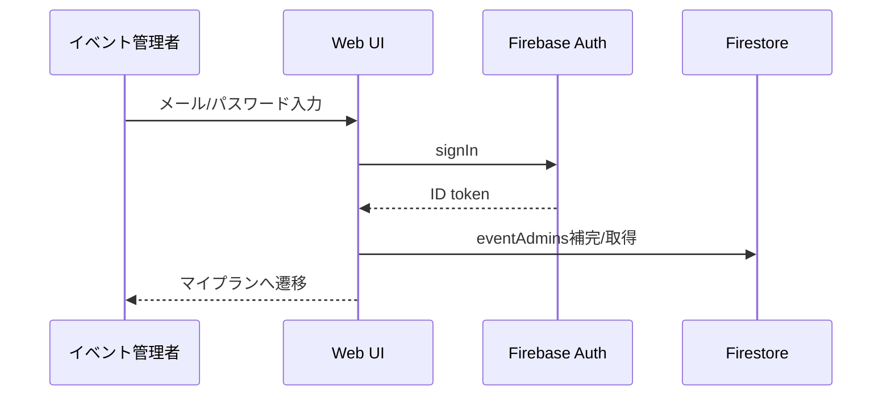
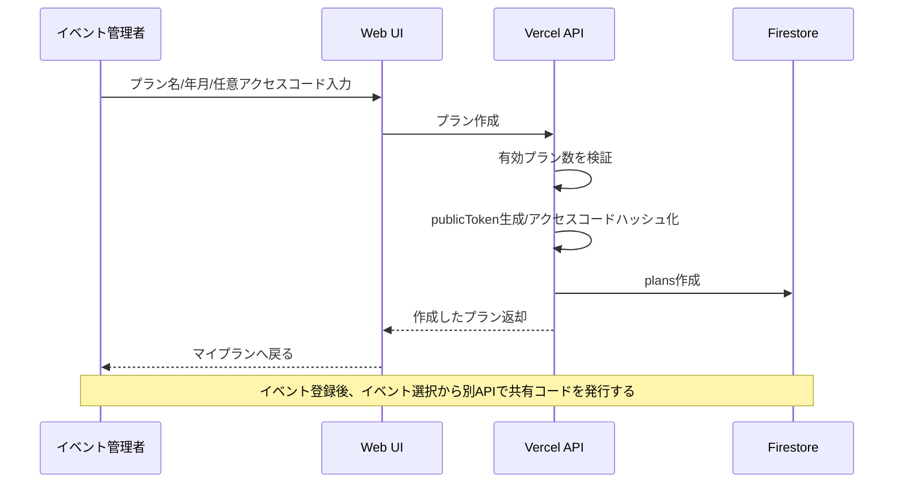
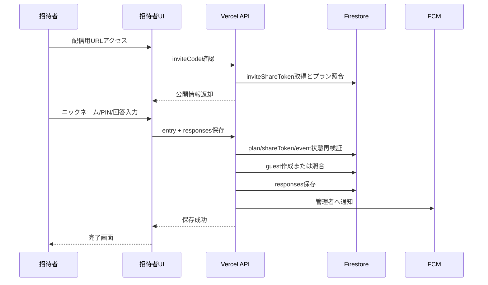
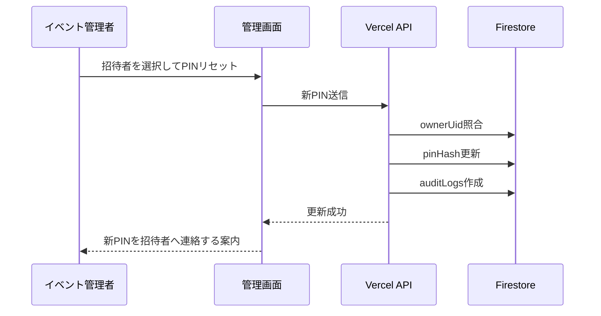

# RSVP Hub MVPシステム設計書

作成日: 2026-06-01
実装照合日: 2026-10-06（v1.1.0および短縮招待URL対応）

現行の制約・未保証事項は [実装と文書の整合確認](implementation-audit.md) を参照する。

## 1. 位置づけ

本書は `docs/mvp-requirements.md` を実装可能な構造へ落とし込むためのMVPシステム設計書である。

MVPでは、以下を最優先で守る。

- イベント管理者ごとのデータ分離
- 招待者に他招待者の回答やPIN関連情報を見せない
- 無効化済みプラン、無効化済みイベント、締切済イベントへの不正更新を防ぐ
- 4桁PINとアクセスコードを平文保存しない
- スマホ招待者UIとPC管理画面の両立
- 業務アプリ寄りの落ち着いたUIで、出欠状況を効率よく確認、集計できること

## 2. 前提

- ホスティングはVercelとする。
- 本番URLは `https://rsvphub.bamboosato.com` とする。
- 認証はFirebase Authenticationを使用する。
- データ保存はFirestoreを使用する。
- Push通知はFirebase Cloud Messagingを使用する。
- アプリ管理者向けWeb管理画面はMVP対象外とする。
- イベント管理者アカウントは、アプリ管理者がFirebase Consoleで手動作成する。
- イベント管理者ごとにデータを分離する。
- 招待者はFirebase Authenticationにログインしない。

## 3. 全体構成


```mermaid
flowchart LR
  admin["イベント管理者ブラウザ"] --> web["Vercel Web App"]
  guest["招待者ブラウザ"] --> web
  web --> api["Vercel API層"]
  web --> auth["Firebase Auth"]
  api --> auth
  api --> db["Firestore"]
  api --> fcm["Firebase Cloud Messaging"]
  web --> db
  api --> line["LINE Messaging API"]
  line -->|Webhook| api
  api --> storage["Firebase Storage"]
  admin -. "通知許可/FCM token登録" .-> fcm
  fcm -. "Push通知" .-> admin
```

### 3.1 役割分担

| 領域 | 責務 |
| --- | --- |
| Web UI | 管理画面、招待者画面、入力状態管理、表示制御 |
| Firebase Auth | イベント管理者のログイン、ログアウト、パスワードリセット |
| Vercel API層 | PIN・アクセスコード照合、招待URL発行、招待者回答保存、LINE登録・配信、通知送信、監査ログ記録 |
| Firestore | プラン、イベント、招待者、回答、共有コード、LINE関連データ、通知token、監査ログの永続化 |
| FCM | イベント管理者への回答更新通知 |
| LINE Messaging API | 登録コード受信、プロフィール取得、返信、管理者指定の招待URL配信 |
| Firebase Storage | LINEプロフィール画像の保存 |

### 3.2 正規URL

- 本番環境では `NEXT_PUBLIC_APP_BASE_URL=https://rsvphub.bamboosato.com` を設定する。
- 管理画面のURLコピー、招待者向け配信用URL、Push通知の遷移先URLは、設定済みの正規URLを優先して生成する。
- `NEXT_PUBLIC_APP_BASE_URL` が未設定の場合は、ローカル開発向けに現在のリクエストoriginまたはブラウザoriginを使用する。
- Firebase Authentication の Authorized domains に `rsvphub.bamboosato.com` を追加する。

## 4. アプリケーション境界

### 4.1 クライアントから直接扱ってよい処理

- イベント管理者ログイン、ログアウト
- イベント管理者ログインパスワードリセットメール送信
- 管理画面での自分のプラン、イベント、回答の閲覧
- 管理画面のイベント作成・編集・受付状態変更・無効化（Firestore Web SDK。Rulesで所有者を検証）
- 管理者プロフィール補完
- 通知許可状態の表示
- FCM token登録要求

### 4.2 API層を必ず経由する処理

- アクセスコード照合
- 招待者のニックネーム+PIN照合
- 招待者の初回登録
- 招待者回答の保存
- PINリセット
- アクセスコードのハッシュ化保存
- プラン作成・更新・無効化と招待URL発行
- 管理者の回答代理追加・修正
- LINE登録情報取得・友だち編集・配信・Webhook処理
- 通知送信
- API経由の操作に対応する監査ログ記録

理由:

- PINは4桁で総当たりされやすいため、`pinHash` を招待者クライアントへ返さない。
- アクセスコードも招待者クライアントへ返さない。
- 招待者保存時は、プラン有効状態、イベント有効状態、締切状態をサーバー側で再検証する。
- 通知送信はサーバー側の認証情報を必要とする。

## 5. 画面ルーティング

| パス | 画面 | 認証 |
| --- | --- | --- |
| `/` | 公開トップ | 不要 |
| `/help` | ヘルプ・PDFマニュアルへのリンク | 不要 |
| `/terms` | 利用規約 | 不要 |
| `/privacy` | プライバシーポリシー | 不要 |
| `/login` | イベント管理者ログイン | 未ログイン |
| `/password-reset` | ログインパスワードリセット | 未ログイン |
| `/admin/plans` | マイプラン | イベント管理者ログイン必須 |
| `/admin/account` | アカウント設定、LINE連携、LINE友だち一覧 | イベント管理者ログイン必須 |
| `/admin/plans/new` | プラン追加 | イベント管理者ログイン必須 |
| `/admin/plans/{planId}` | プラン詳細、イベント一覧 | イベント管理者ログイン必須 |
| `/admin/plans/{planId}/edit` | プラン編集 | イベント管理者ログイン必須 |
| `/admin/plans/{planId}/events/new` | イベント追加 | イベント管理者ログイン必須 |
| `/admin/plans/{planId}/events/{eventId}` | イベント詳細、出欠内訳 | イベント管理者ログイン必須 |
| `/admin/plans/{planId}/events/{eventId}/edit` | イベント編集 | イベント管理者ログイン必須 |
| `/i/{inviteCode}` | 招待者アクセス開始・アクセスコード入力 | 不要 |
| `/i/{inviteCode}/entry` | 招待者本人識別 | 不要。アクセスコード設定時は通過Cookie必須 |
| `/i/{inviteCode}/responses` | 出欠入力 | 招待者セッション必須 |
| `/i/{inviteCode}/complete` | 出欠入力完了 | 保存完了状態（クライアントsessionStorage） |

エラーは各画面内に表示する。独立した `/error` ページと旧 `/invite/...` ページは存在しない。

## 6. API設計

### 6.1 管理者向けAPI

| API | Method | 認証 | 内容 |
| --- | --- | --- | --- |
| `/api/admin/plans` | POST | Firebase ID token | プラン作成 |
| `/api/admin/plans/{planId}` | PATCH/DELETE | Firebase ID token | プラン更新、アクセスコード変更・解除、無効化と共有コード失効 |
| `/api/admin/plans/{planId}/invite-share-tokens` | POST | Firebase ID token | 選択イベント集合を保持する短縮招待コード発行 |
| `/api/admin/events/{eventId}/responses` | GET/POST | Firebase ID token | 出欠内訳取得、管理者代理回答追加 |
| `/api/admin/responses/{responseId}` | PATCH/DELETE | Firebase ID token | 管理者回答修正、回答無効化と監査記録 |
| `/api/admin/guests/{guestId}/pin-reset` | POST | Firebase ID token | PINリセット |
| `/api/admin/notification-tokens` | POST | Firebase ID token | FCM token登録 |
| `/api/admin/line/registration` | GET | Firebase ID token | LINE友だち登録URL、QRコード用情報取得 |
| `/api/admin/line/friends` | GET | Firebase ID token | LINE友だち一覧取得 |
| `/api/admin/line/friends/{friendId}` | PATCH/DELETE | Firebase ID token | LINE友だちのメモ、配信対象、削除 |
| `/api/admin/line/messages` | POST | Firebase ID token | 選択イベントの配信用URLをLINE友だちへ送信 |

イベント作成・更新・受付状態変更・無効化は `src/features/admin/events/data.ts` からFirestore Web SDKで行う。
`/api/admin/plans/{planId}/events`、`/api/admin/events/{eventId}`、`.../disable` は実装されていない。

### 6.2 招待者向けAPI

| API | Method | 認証 | 内容 |
| --- | --- | --- | --- |
| `/api/i/{inviteCode}` | GET | 不要 | コード照合、プラン公開情報取得 |
| `/api/i/{inviteCode}/password` | POST | 不要 | アクセスコード照合、通過Cookie発行 |
| `/api/i/{inviteCode}/entry` | POST | アクセスコード設定時は通過Cookie | ニックネーム+PIN照合、招待者セッション発行 |
| `/api/i/{inviteCode}/responses` | GET | 招待者セッション | 自分の回答取得 |
| `/api/i/{inviteCode}/responses` | POST | 招待者セッション | 自分の回答保存 |

`GET /api/i/{inviteCode}/responses` は、共有コードに保存された `eventIds` に含まれる有効イベントを返す。URL作成後に締切済みへ変更されたイベントも返すが、招待者による更新は不可とする。削除/無効化済みイベントは返さない。旧 `/api/invite/...` APIは提供しない。

### 6.3 LINE Webhook

| API | Method | 認証 | 内容 |
| --- | --- | --- | --- |
| `/api/line/webhook/{lineAccountId}` | POST | LINE署名検証 | follow/unfollow/message event受信 |

- 既定URLは `/api/line/webhook/default` とする。
- `x-line-signature` を `LINE_CHANNEL_SECRET` で検証する。
- text messageから登録コード単体を解析し、管理者アカウントとLINE userIdを紐づける。
- 既存案内との互換性のため、`登録 {code}` 形式も受け付ける。
- 登録成功時はLINEプロフィールを取得し、取得できる場合は画像をFirebase Storageへ保存する。
- unfollow eventでは対象LINE userIdを配信対象外にする。

### 6.4 招待者セッション

- 招待者はFirebase Authenticationにログインしない。
- `entry` APIでニックネーム+PIN照合に成功した場合、短期の招待者セッションを発行する。
- セッションには `kind`、`inviteCode`、`planId`、`guestId`、`ownerUid`、`nickname`、有効期限 `exp` を含める。
- `rsvp_invite_session` とアクセスコード通過用 `rsvp_invite_password` をHMAC-SHA256署名付きHttpOnly Cookieで保持する。SameSite=Lax、本番はSecure、pathは `/` とする。
- どちらのCookieも発行から24時間有効とし、種別・コード・署名・期限を照合する。
- セッション期限切れ時は、ニックネーム+PIN入力へ戻す。
- PINリセットやアクセスコード変更で発行済みCookieを即時失効させる実装はない。新たな照合には新しい値が必要だが、既存Cookieは期限まで利用可能。
- Cookieは各種別につきブラウザで1つのため、別招待コードで本人識別すると以前のコードのセッションを上書きする。

## 7. データモデル

トップレベルコレクションを使い、管理対象データに `ownerUid` を持たせる。管理者プロフィールはドキュメントIDのUIDで分離する。

```text
eventAdmins/{uid}
plans/{planId}
events/{eventId}
guests/{guestId}
responses/{responseId}
inviteShareTokens/{inviteCode}
notificationTokens/{tokenId}
lineRegistrationCodes/{code}
lineRegistrationCodeOwners/{lineAccountId_ownerUid}
lineFriends/{friendId}
lineMessageDeliveries/{deliveryId}
auditLogs/{auditLogId}
```

### 7.1 eventAdmins

| フィールド | 型 | 必須 | 内容 |
| --- | --- | --- | --- |
| uid | string | yes | Firebase Auth UID |
| email | string | yes | イベント管理者メールアドレス |
| displayName | string | no | 表示名 |
| isActive | boolean | yes | 有効状態 |
| createdAt | timestamp | yes | 作成日時 |
| updatedAt | timestamp | yes | 更新日時 |

MVPでは、アプリ管理者がFirebase ConsoleでAuthユーザーを作成する。アプリ側の `eventAdmins` 作成は初回ログイン時に自動作成するか、管理者初回アクセス時に補完する。

### 7.2 plans

| フィールド | 型 | 必須 | 内容 |
| --- | --- | --- | --- |
| planId | string | yes | プランID |
| ownerUid | string | yes | 作成したイベント管理者UID |
| name | string | yes | プラン名 |
| yearMonth | string | yes | `YYYY-MM` |
| passwordHash | string/null | no | アクセスコードのハッシュ |
| publicToken | string | yes | 共有コードから対象プランを照合する内部token |
| isActive | boolean | yes | 有効状態 |
| createdAt | timestamp | yes | 作成日時 |
| updatedAt | timestamp | yes | 更新日時 |

補足:

- 共有コードの内部参照先として `publicToken` を保持する。
- `publicToken` は十分に長いランダム値にし、推測困難にする。
- 招待者アクセスの入口は `inviteCode`。本人識別はニックネーム+PINで別途行う。
- `publicToken` をログに不用意に出力しない。

### 7.3 events

| フィールド | 型 | 必須 | 内容 |
| --- | --- | --- | --- |
| eventId | string | yes | イベントID |
| planId | string | yes | 所属プランID |
| ownerUid | string | yes | プラン所有者UID |
| name | string | no | イベント名 |
| eventDate | string | yes | `YYYY-MM-DD` |
| timeSlot | string | yes | `AM` / `PM` |
| timeDetail | string | no | 時間帯補足。40文字以内。旧データ未設定時は空文字として表示 |
| place | string | yes | 場所 |
| status | string | yes | `accepting` / `closed` |
| sortOrder | number | yes | 同一日時内の登録順 |
| isActive | boolean | yes | 有効状態 |
| createdAt | timestamp | yes | 作成日時 |
| updatedAt | timestamp | yes | 更新日時 |

### 7.4 guests

| フィールド | 型 | 必須 | 内容 |
| --- | --- | --- | --- |
| guestId | string | yes | 招待者ID |
| planId | string | yes | 所属プランID |
| ownerUid | string | yes | プラン所有者UID |
| nickname | string | yes | 表示用ニックネーム |
| nicknameKey | string | yes | 重複判定用キー |
| pinHash | string | yes | PINのハッシュ |
| pinResetAt | timestamp/null | no | PINリセット日時 |
| pinResetByUid | string/null | no | PINリセットしたイベント管理者UID |
| createdAt | timestamp | yes | 作成日時 |
| updatedAt | timestamp | yes | 更新日時 |

制約:

- `planId + nicknameKey` は一意に扱う。
- Firestore単体で一意制約が弱い場合は、API層でトランザクションまたは一意キー用ドキュメントを使う。

### 7.5 responses

| フィールド | 型 | 必須 | 内容 |
| --- | --- | --- | --- |
| responseId | string | yes | 回答ID |
| isActive | boolean | no | falseは無効化。旧データ未設定時は有効として扱う |
| planId | string | yes | プランID |
| eventId | string | yes | イベントID |
| guestId | string | yes | 招待者ID |
| ownerUid | string | yes | プラン所有者UID |
| attendanceStatus | string | yes | `yes` / `maybe` / `no` |
| comment | string | no | コメント |
| answeredAt | timestamp | yes | 回答日時 |
| lastUpdatedBy | string | yes | `admin` / `guest` |
| lastUpdatedByUid | string/null | no | 管理者更新時のUID |
| createdAt | timestamp | yes | 作成日時 |
| updatedAt | timestamp | yes | 更新日時 |

制約:

- `eventId + guestId` は一意に扱う。
- 招待者保存では、対象イベントが有効かつ受付中であることをAPI層で再検証する。
- 回答無効化は出欠内訳・集計から除外する。招待者を削除せず、次回の受付中イベント保存で同じ回答IDを再有効化する。

### 7.6 inviteShareTokens

| フィールド | 型 | 必須 | 内容 |
| --- | --- | --- | --- |
| token | string | yes | 共有トークン。ドキュメントIDと同じ値 |
| inviteCode | string | yes | 短縮URLパスの6文字コード。新規ドキュメントID・tokenと同じ |
| publicToken | string | yes | 内部のプラン照合用token |
| planId | string | yes | 対象プランID |
| ownerUid | string | yes | プラン所有者UID |
| eventIds | string[] | yes | URL発行時に固定した表示対象イベントID |
| eventId | string/null | no | 先頭イベントIDの補助情報 |
| participantId | string/null | no | 将来拡張用。新規発行時はnull |
| expiresAt | timestamp/null | no | 新規発行時はnull。設定値が過去ならコード照合で拒否 |
| status | string | yes | active / revoked |
| isActive | boolean | yes | 有効状態 |
| createdAt | timestamp | yes | 作成日時 |
| updatedAt | timestamp | yes | 更新日時 |
| revokedAt | timestamp/null | no | 無効化日時 |
| revokedReason | string/null | no | 無効化理由 |

制約:

- 招待者向けURLは `/i/{inviteCode}` 形式とする。queryの `share` は使用しない。
- 新規コードは `ABCDEFGHJKLMNPQRSTUVWXYZ23456789` からランダムに6文字を生成し、作成時に衝突した場合は最大12回試行する。
- 既存の長い共有トークンも同コレクションのドキュメントIDとして検索可能だが、旧形式のURLを提供する画面/APIはない。
- 不正コード、存在しないコード、無効化済み・期限切れ・対象プラン不一致はエラー扱いにする。
- トークン作成時は、指定イベントが対象プラン配下、有効、締切済みではないことをAPI層で再検証する。
- トークン作成後にイベントの並び順やステータスが変わっても、`eventIds` に保存された対象イベント集合は変更しない。
- トークン作成後に対象イベントが締切済みになった場合、招待者回答画面には表示するが、保存APIでは更新を拒否する。
- トークン作成後に対象イベントが削除/無効化された場合、招待者回答画面には表示しない。
- 招待者回答保存時は、送信された `eventId` が共有トークンの `eventIds` に含まれることをAPI層で再検証する。
- プラン削除時は、対象プランに紐づく有効な共有トークンを `isActive=false` に更新する。
- `inviteShareTokens` はサーバーAPI専用データとし、Firestore Security Rulesではクライアント直接アクセスを許可しない。

### 7.7 notificationTokens

| フィールド | 型 | 必須 | 内容 |
| --- | --- | --- | --- |
| tokenId | string | yes | token識別子 |
| ownerUid | string | yes | イベント管理者UID |
| fcmToken | string | yes | FCM token |
| userAgent | string | no | 端末識別補助 |
| isActive | boolean | yes | 有効状態 |
| lastSeenAt | timestamp | yes | 最終登録確認日時 |
| createdAt | timestamp | yes | 作成日時 |
| updatedAt | timestamp | yes | 更新日時 |

`tokenId` はFCM tokenをSHA-256でハッシュ化した値とし、token本文をドキュメントIDに直接使わない。送信時に無効tokenが検出された場合は `isActive=false` に更新する。

### 7.8 auditLogs

| フィールド | 型 | 必須 | 内容 |
| --- | --- | --- | --- |
| auditLogId | string | yes | 監査ログID |
| ownerUid | string | yes | 対象データ所有者UID |
| actorType | string | yes | `admin` / `guest` / `system` |
| actorUid | string/null | no | イベント管理者UID |
| action | string | yes | 操作種別 |
| targetType | string | yes | 対象種別 |
| targetId | string | yes | 対象ID |
| summary | string | no | 操作概要 |
| createdAt | timestamp | yes | 記録日時 |

記録対象:

- PINリセット
- 管理者代理回答追加
- 管理者回答修正
- 管理者回答無効化
- プラン無効化
- イベント無効化は現行の直接更新処理では監査ログを作成していない。記録の追加は今後の改善対象とする。

### 7.9 LINE関連データ

以下はサーバー専用で、Firestore Rulesの末尾の拒否規則によりクライアント直接アクセスを許可しない。
Admin SDK経由のため、APIで所有者またはWebhook署名を検証する。

| コレクション | 主な項目・役割 |
| --- | --- |
| `lineRegistrationCodes/{code}` | code、ownerUid、lineAccountId、isActive、createdAt、updatedAt。10文字コードから管理者を解決する。 |
| `lineRegistrationCodeOwners/{lineAccountId_ownerUid}` | code、ownerUid、lineAccountId、isActive、createdAt、updatedAt。管理者の現行コードを再利用する。 |
| `lineFriends/{friendId}` | ownerUid、lineAccountId、lineUserId、displayName、pictureUrl、linePictureUrl、pictureStoragePath、memo、isActive、isDeliverable、isFriend、registrationCode、registeredAt、blockedAt、deletedAt、createdAt、updatedAt。 |
| `lineMessageDeliveries/{deliveryId}` | ownerUid、planId、eventIds、shareToken、friendId、lineUserId、displayName、status（accepted/failed）、responseStatus、errorMessage、createdAt、updatedAt。 |

`friendId` はlineAccountId・ownerUid・lineUserIdのSHA-256で生成し、同じ管理者への再登録で重複を防ぐ。
プロフィール画像をStorageに保存できない場合も登録を継続する。
友だち削除は `isActive=false`、`isDeliverable=false` の無効化であり、Storage画像の削除は行わない。
LINE登録コードと短縮招待コードは別コレクション・別用途であり、出欠の `guestId` とは自動連携しない。

## 8. インデックス設計

Firestoreで必要になる主な検索条件:

| 対象 | 条件 | 並び順 |
| --- | --- | --- |
| plans | `ownerUid == currentUid`, `isActive` | `createdAt asc` |
| events | `ownerUid == currentUid`, `planId == planId`, `isActive` | `eventDate asc`, `timeSlot asc`, `sortOrder asc` |
| guests | `ownerUid == currentUid`, `planId == planId` | `nicknameKey asc` |
| responses | `ownerUid == currentUid`, `eventId == eventId` | `answeredAt desc` |
| responses | `planId == planId`, `guestId == guestId` | `eventId asc` |
| inviteShareTokens | `ownerUid == currentUid`, `planId == planId`, `isActive == true` | なし |
| notificationTokens | `ownerUid == currentUid`, `isActive == true` | なし |
| auditLogs | `ownerUid == currentUid`, `targetId == targetId` | `createdAt desc` |

## 9. セキュリティ設計

### 9.1 イベント管理者データ分離

- すべての管理対象データに `ownerUid` を持たせる。
- イベント管理者は `auth.uid == ownerUid` のデータのみ閲覧、編集できる。
- Firestore Security Rulesでも同条件を必ず検証する。
- API層でもFirebase ID tokenを検証し、`ownerUid` が一致するか確認する。

### 9.2 招待者データ保護

- 招待者向けAPIでは、他招待者の `guests`、`responses` を返さない。
- 招待者向けAPIでは、`pinHash`、`passwordHash` を返さない。
- 招待者は自分の `guestId` に紐づく回答だけ取得できる。
- 招待者セッションの `planId`、`guestId`、`ownerUid` とリクエスト対象を照合する。

### 9.3 PINとアクセスコード

- PIN、アクセスコードは平文保存しない。
- ハッシュ化はAPI層で行う。
- 4桁PINは低エントロピーのため、`pinHash` をクライアントに返さない。
- PIN照合失敗回数が短時間で多い場合は、レート制限を検討する。

### 9.4 publicToken

- publicTokenは推測困難なランダム値にする。
- 共有コードの参照先として `plans.publicToken` を保持する。短縮URLへ直接含めない。
- `publicToken` は `ownerUid` によるアクセス制御でイベント管理者本人だけが閲覧できるようにする。
- 招待者向けAPIは `inviteCode` から `inviteShareTokens` を取得し、その内部 `publicToken` からプランを特定する。
- コードとプランの `planId`、`ownerUid` を照合し、固定イベント集合を検証する。
- `publicToken` だけで回答編集を許可せず、アクセスコード、ニックネーム、PIN、招待者セッションで追加確認する。

## 10. 主要処理フロー

### 10.1 イベント管理者ログイン


```mermaid
sequenceDiagram
  participant A as イベント管理者
  participant UI as Web UI
  participant Auth as Firebase Auth
  participant DB as Firestore
  A->>UI: メール/パスワード入力
  UI->>Auth: signIn
  Auth-->>UI: ID token
  UI->>DB: eventAdmins補完/取得
  UI-->>A: マイプランへ遷移
```

### 10.2 プラン作成


```mermaid
sequenceDiagram
  participant A as イベント管理者
  participant UI as Web UI
  participant API as Vercel API
  participant DB as Firestore
  A->>UI: プラン名/年月/任意アクセスコード入力
  UI->>API: プラン作成
  API->>API: 有効プラン数を検証
  API->>API: publicToken生成/アクセスコードハッシュ化
  API->>DB: plans作成
  API-->>UI: 作成したプラン返却
  UI-->>A: マイプランへ戻る
  Note over A,DB: イベント登録後、イベント選択から別APIで共有コードを発行する
```

### 10.3 招待者初回回答


```mermaid
sequenceDiagram
  participant G as 招待者
  participant UI as 招待者UI
  participant API as Vercel API
  participant DB as Firestore
  participant FCM as FCM
  G->>UI: 配信用URLアクセス
  UI->>API: inviteCode確認
  API->>DB: inviteShareToken取得とプラン照合
  API-->>UI: 公開情報返却
  G->>UI: ニックネーム/PIN/回答入力
  UI->>API: entry + responses保存
  API->>DB: plan/shareToken/event状態再検証
  API->>DB: guest作成または照合
  API->>DB: responses保存
  API->>FCM: 管理者へ通知
  API-->>UI: 保存成功
  UI-->>G: 完了画面
```

### 10.4 PINリセット


```mermaid
sequenceDiagram
  participant A as イベント管理者
  participant UI as 管理画面
  participant API as Vercel API
  participant DB as Firestore
  A->>UI: 招待者を選択してPINリセット
  UI->>API: 新PIN送信
  API->>DB: ownerUid照合
  API->>DB: pinHash更新
  API->>DB: auditLogs作成
  API-->>UI: 更新成功
  UI-->>A: 新PINを招待者へ連絡する案内
```

## 11. 状態遷移設計

### 11.1 プラン

| 現状態 | 操作 | 次状態 | 実行者 |
| --- | --- | --- | --- |
| 有効 | 無効化 | 無効 | イベント管理者 |

MVPでは再有効化は必須ではない。

### 11.2 イベント

| 現状態 | 操作 | 次状態 | 実行者 |
| --- | --- | --- | --- |
| 受付中 | 締切 | 締切済 | イベント管理者 |
| 締切済 | 受付再開 | 受付中 | イベント管理者 |
| 有効 | 無効化 | 無効 | イベント管理者 |

### 11.3 回答

| 現状態 | 操作 | 次状態 | 実行者 |
| --- | --- | --- | --- |
| 未回答 | 回答保存 | 回答済 | 招待者 / イベント管理者 |
| 回答済 | 再編集 | 回答済 | 招待者 |
| 回答済 | 管理者修正 | 回答済 | イベント管理者 |

## 12. エラー設計

| エラー | 表示方針 | ログ |
| --- | --- | --- |
| inviteCode不正・失効 | 「配信用URLが正しくありません。」 | API応答。操作エラーは各画面へ表示 |
| プラン無効 | 「このプランは現在利用できません。」 | info |
| アクセスコード不一致 | 入力欄近くにエラー表示 | warn |
| 同一ニックネーム別PIN | 「同じニックネームは既に使用されています。」 | warn |
| 締切済イベント更新 | 対象イベントの保存不可を表示 | info |
| ネットワークエラー | 再試行案内 | error |
| 通知送信失敗 | 管理画面には通常表示しない。ログに残す | warn |

## 13. 通知設計

### 13.1 token登録

- 管理画面でブラウザ・管理者UIDごとに初回の通知許可を自動要求する。localStorageで要求済みを記録し、実際のダイアログ表示はブラウザに依存する。
- ブラウザ側で自動要求が抑制された場合、または後から許可したい場合は、マイプランの「通知を有効にする」から再試行できる。
- 許可された場合、FCM tokenを取得し `notificationTokens` に保存する。
- 同一イベント管理者が複数端末で許可した場合、複数tokenを保持する。
- 送信エラーが登録無効・不正tokenの場合に `isActive = false` に更新する。一時的な送信失敗だけでは無効化しない。

### 13.2 送信条件

- 招待者が回答を追加または更新した場合に送信する。
- イベント管理者による代理追加、修正、PINリセットでは送信しない。
- 通知失敗は回答保存を失敗にしない。

### 13.3 通知クリック

- 通知データに対象プランのURL `/admin/plans/{planId}` を含める。
- Service Worker の `notificationclick` で既存タブを対象URLへ遷移、既存タブがない場合は新規ウィンドウで開く。
- 未ログインの場合は `ProtectedRoute` によりログイン画面を経由する。

### 13.4 PWA

- `src/app/manifest.ts` でPWA manifestを提供する。
- `public/sw.js` でService Workerを提供する。
- Service WorkerはアイコンとNext静的アセットをcache-first、画面遷移をnetwork-firstで扱う。
- PWA用アイコンはSVGに加え、192px、512pxのPNGを提供する。
- API保存やLINE配信のオフラインキューは提供しない。ローカルホストではService Worker登録解除とキャッシュ削除を行う。
- Service Worker更新確認とSKIP_WAITINGを行い、新workerへの切り替え時に再読込する。対応環境ではPush受信時にバッジを付け、通知タップや管理画面表示で解除する。

### 13.5 LINE手動配信

- `/api/admin/line/messages` は管理者ID tokenを検証し、プラン所有者、有効状態、選択イベントの所属・有効・受付中、友だちの所有者・有効・配信対象・友だち状態を検証する。
- 1回のリクエストはイベント1〜100件、友だち1〜50件、挨拶文500文字以内。重複IDを拒否し、空の挨拶文は許可する。
- リクエストごとに共有コードを発行し、同一URLを各宛先へ送る。本文は編集済み挨拶文とURLを空行で結合する。
- 送信先別にAPI受付結果を記録し、成功/失敗件数と結果一覧を返す。結果ログの保存失敗は送信結果と分離してサーバーログへ記録する。
- 自動リトライ・送信要求の重複排除・既読確認は実装していない。

## 14. 非機能設計

### 14.1 レスポンシブ

- 招待者画面はスマホ幅を基準に設計する。
- 招待者画面はニックネーム+PIN入力後、各イベントに対して `○`、`△`、`×` を大きめのボタンで選択できる1カラムUIにする。
- 管理画面はPCで表形式と詳細ペインを扱いやすくする。
- 管理画面のマイプラン、イベント一覧、出欠内訳はテーブル中心で構成する。
- 管理画面の `○`、`△`、`×` 人数はカードまたはバッジで一目で分かるようにする。
- スマホ管理画面もレイアウトが崩れず、閲覧、操作できるようにする。

### 14.2 ビジュアル方針

- UIはサークル向けのカジュアルアプリではなく、出欠状況を効率よく確認、集計するためのビジネスアプリ寄りにする。
- 全体のデザインは白、グレーをベースにし、アクセントカラーを1色だけ使用する。
- アクセントカラーは主要アクション、選択状態、重要な状態表示に限定する。
- 派手な装飾、SNS風、ゲーム風、ポップすぎる表現は避ける。
- 管理画面では装飾的なカード多用を避け、テーブル、バッジ、必要最小限のサマリーカードを中心に構成する。

### 14.3 競合・非同期

- 招待者保存時にプラン、イベント状態を再取得して検証する。
- 有効プラン3件制限はAPI層のトランザクションで検証する。
- 同一ニックネーム登録はAPI層で一意性を保証する。
- 同時回答保存では `eventId + guestId` の一意性を保証する。

### 14.4 ログ・証跡

- 管理者による重要操作は `auditLogs` に記録する。
- 通知送信失敗は調査できる粒度でログに残す。
- 招待者の通常回答保存は `responses` の `answeredAt` と `lastUpdatedBy` で追跡する。

## 15. 実装時の注意点

- Firestore Security Rulesだけに依存せず、API層でも所有者と状態を検証する。
- 招待者クライアントへハッシュ値や他招待者情報を返さない。
- PINを数値として扱わず、常に4桁文字列として扱う。
- `○`、`△`、`×` はUI表示値と保存値を分離する。
- 通常画面は無効化とする。開発者向け物理削除はREADMEのMaintenanceを参照する。
- 通知許可は管理画面でブラウザ・管理者UIDごとに初回の自動要求を行い、失敗時や後からの許可は管理画面のボタンで再試行する。

## 16. テスト設計観点

テストケース作成時は、以下の順で観点を列挙してから詳細化する。

### 16.1 機能観点

- イベント管理者認証
- プラン作成、更新、無効化
- 有効プラン3件制限
- イベント作成、更新、無効化
- 招待者初回回答、再編集
- 管理者代理追加、回答修正
- PINリセット
- Push通知

### 16.2 非機能観点

- スマホ招待者UI
- PC管理画面
- 業務アプリ寄りの視認性
- 管理画面テーブルのスマホ崩れ防止
- 低速回線
- 通知拒否
- 複数端末通知
- Firestore権限エラー
- API失敗時の再試行

### 16.3 データ観点

- PIN `0000`、`9999`
- 先頭0を含むPIN
- 同一ニックネーム同一PIN
- 同一ニックネーム別PIN
- 長いニックネーム
- 長いコメント
- イベント名未入力
- 無効化済みデータ

### 16.4 UI観点

- 締切済イベントの非活性表示
- 保存中、保存成功、保存失敗
- URLコピー成功、失敗
- 通知有効化案内
- PINリセット確認

## 17. MVP外として扱う設計

- 管理チーム単位のデータ共有
- イベント管理者招待URL
- イベント管理者自己登録
- プラン有効期限
- 定員管理
- 既存招待URLの個別失効・置換（新しい共有コードの追加発行は実装済み）
- tennis-organizing-app連携
